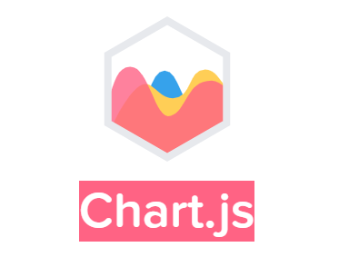

# ChartJs

<div style="margin-bottom: 10px;"></div>

¿Qué es ChartJs?

<div style="margin-bottom: 10px;"></div>



<div style="margin-bottom: 30px;"></div>

**ChartJs**, es una biblioteca de gráficos interactivos de JavaScript de código abierto que permite crear visualizaciones de datos en el navegador web. Fue desarrollada por Nick Downie y se lanzó por primera vez en 2013. Chart.js se basa en la etiqueta canvas de HTML5 y utiliza el poder de JavaScript para generar gráficos dinámicos y atractivos.

El objetivo principal de Chart.js es proporcionar una solución fácil de usar y flexible para la visualización de datos en aplicaciones web. La biblioteca ofrece una amplia gama de tipos de gráficos, como gráficos de barras, gráficos circulares, gráficos de líneas, gráficos de dispersión y más. Además, permite la interacción con los gráficos mediante eventos de clic y desplazamiento, lo que proporciona una experiencia de usuario mejorada.

Chart.js se destaca por su facilidad de uso y su API intuitiva, lo que permite a los desarrolladores crear rápidamente gráficos y personalizarlos según sus necesidades. La biblioteca también ofrece opciones de personalización, como colores, títulos, etiquetas y leyendas, lo que permite adaptar los gráficos al estilo y diseño de la aplicación.

  <div style="margin-bottom: 30px;"></div>

## Ventajas de ChartJs

  <div style="margin-bottom: 30px;"></div>

+ **Fácil de usar:** Chart.js tiene una API intuitiva y bien documentada que facilita la creación de gráficos.
+ **Amplia gama de gráficos:** Ofrece una variedad de tipos de gráficos y opciones de personalización para adaptarse a diferentes necesidades.
+ **Interactividad:** Permite interacciones como eventos de clic y desplazamiento para proporcionar una experiencia más dinámica.
+ **Respuesta y rendimiento:** Chart.js es ligero y ofrece un rendimiento rápido, lo que lo hace adecuado para visualizar conjuntos de datos pequeños a medianos.
+ **Buena compatibilidad con navegadores:** Funciona bien en la mayoría de los navegadores modernos.  
<div style="margin-bottom: 30px;"></div>

### Desventajas de ChartJs
<div style="margin-bottom: 10px;"></div>

+ **Menos personalización:** Aunque ofrece opciones de personalización, Chart.js puede ser limitado en comparación con D3.js en términos de personalización y flexibilidad extrema.
* **Limitaciones en la visualización de datos complejos:** Si necesitas visualizar datos complejos o realizar manipulaciones avanzadas en los gráficos, Chart.js puede no ser la mejor opción.
<div style="margin-bottom: 30px;"></div>

### Comparación con D3.js
<div style="margin-bottom: 10px;"></div>
D3.js (Data-Driven Documents) es una biblioteca de JavaScript más amplia y potente para la manipulación y visualización de datos. A diferencia de Chart.js, D3.js no se enfoca únicamente en gráficos, sino que también permite manipular y transformar datos, así como crear visualizaciones personalizadas y complejas. Algunas ventajas y desventajas de D3.js 

<div style="margin-bottom: 30px;"></div>

### Ventajas de D3.js sobre Chart.js
<div style="margin-bottom: 10px;"></div>

+ **Mayor personalización:** D3.js ofrece una mayor flexibilidad y control sobre los gráficos y las visualizaciones, lo que permite crear diseños personalizados y visualizaciones más complejas.
+ **Manipulación de datos:** D3.js proporciona herramientas para manipular y transformar los datos antes de visualizarlos, lo que es especialmente útil para tareas de preparación y limpieza de datos.
+ **Comunidad y recursos:** D3.js tiene una comunidad activa y una amplia gama de recursos y ejemplos disponibles en línea.

<div style="margin-bottom: 30px;"></div>

### Desventajas de D3.js en comparación con Chart.js
<div style="margin-bottom: 10px;"></div>

+ **Mayor curva de aprendizaje:** D3.js tiene una curva de aprendizaje más empinada debido a su enfoque más flexible y su API más compleja.
+ **Mayor esfuerzo de desarrollo:** Debido a su mayor flexibilidad, puede requerir más tiempo y esfuerzo para desarrollar visualizaciones personalizadas con D3.js en comparación con Chart.js.
+ **Menos tipos de gráficos predefinidos:** Chart.js ofrece una amplia gama de tipos de gráficos predefinidos, lo que puede ser más conveniente para casos de uso comunes.

<div style="margin-bottom: 30px;"></div>

### Codigo básico de ChartJs
<div style="margin-bottom: 10px;"></div>

1. Canvas y enlace:
    ```
    <script src="https://cdn.jsdelivr.net/npm/chart.js"></script>
    <canvas id="myChart" width="400" height="400"></canvas>
    ```
2. Obtener el elemento canvas y crear un contexto:
    ```
    const canvas = document.getElementById('myChart');
    const ctx = canvas.getContext('2d');
    ```
3. Datos de ejemplo:
    ```
    const data = {
      labels: ['Red', 'Blue', 'Yellow', 'Green', 'Purple', 'Orange'],
      datasets: [{
        label: '# of Votes',
        data: [12, 19, 3, 5, 2, 3],
        backgroundColor: 'rgba(255, 99, 132, 0.2)',
        borderColor: 'rgba(255, 99, 132, 1)',
        borderWidth: 1
      }]
    };
    ``` 
4. Crear el gráfico de barras
    ```
     const myChart = new Chart(ctx, {
          type: 'bar',
          data: data,
          options: {
            scales: {
              y: {
                beginAtZero: true
              }
            }
          }
        });
    ```
<div style="margin-bottom: 30px;"></div>

### Eplicación linea por linea
<div style="margin-bottom: 10px;"></div>

1. Se incluye el script de Chart.js desde un CDN para poder utilizar la biblioteca.

2. Se crea un elemento canvas en el HTML con el id "myChart" para mostrar el gráfico.

3. En el script, se obtiene el elemento canvas mediante document.getElementById() y se crea un contexto 2D utilizando getContext('2d').

4. Se definen los datos de ejemplo para el gráfico. En este caso, hay una etiqueta para cada barra y un conjunto de datos con los valores correspondientes.

5. Se crea una instancia de Chart pasando el contexto y se configura el tipo de gráfico como 'bar' (gráfico de barras). También se proporcionan los datos y opciones adicionales, como la configuración de las escalas del eje y.

6. El gráfico se renderiza en el canvas y se muestra en la página web.