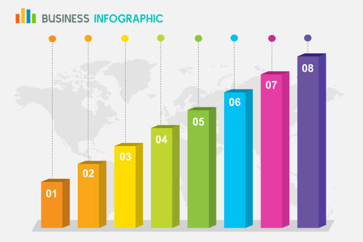
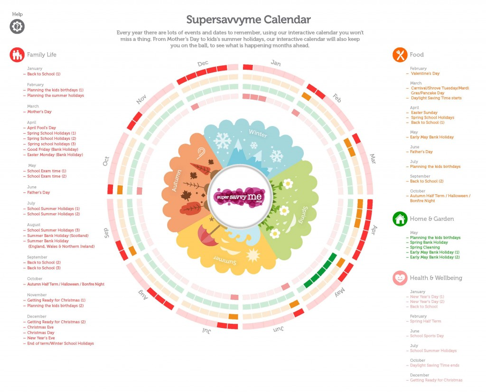

# D3

<div style="margin-bottom: 10px;"></div>

¿Qué es D3?

<div style="margin-bottom: 10px;"></div>


<div style="margin-bottom: 30px;"></div>

**D3**, abreviatura de Data-Driven Documents, es una biblioteca JavaScript de código abierto para la manipulación y visualización de datos en la web. Fue creado por Mike Bostock, un experto en visualización de datos y periodismo interactivo, mientras trabajaba en The New York Times. La primera versión de D3.js se lanzó en 2011.

El objetivo principal de D3.js es proporcionar a los desarrolladores web una forma poderosa y flexible de representar datos complejos a través de gráficos interactivos y visualizaciones. D3.js se basa en los estándares web como HTML, SVG y CSS, y aprovecha las capacidades nativas del navegador para generar visualizaciones dinámicas y personalizables.

D3.js se distingue de otras bibliotecas de visualización de datos al proporcionar una gran cantidad de herramientas y funciones para manipular los elementos DOM y los datos asociados a ellos. A diferencia de las bibliotecas de visualización más enfocadas en la abstracción y en la generación de gráficos predefinidos, D3.js permite a los desarrolladores tener un control completo sobre los componentes de la visualización y cómo interactúan con los datos.

D3.js se utiliza en una amplia variedad de aplicaciones y proyectos, desde visualización de datos interactiva en tiempo real hasta informes y paneles de control. Algunas de las características y capacidades de D3.js incluyen:

+ **Manipulación del DOM:** D3.js permite seleccionar elementos del DOM y manipularlos, estableciendo atributos, estilos y comportamientos dinámicos.

+ **Enlaces de datos:** D3.js facilita la vinculación de datos a elementos del DOM, lo que permite crear visualizaciones basadas en datos y actualizarlas de manera eficiente cuando los datos cambian.

+ **Scales y Axes:** D3.js proporciona escalas y ejes para mapear datos en posiciones y tamaños visuales. Esto facilita la creación de ejes, leyendas y otros elementos de referencia en una visualización.

+ **Generación de gráficos:** D3.js ofrece una amplia gama de generadores de gráficos predefinidos, como barras, líneas, áreas y diagramas de torta. Estos generadores pueden ser personalizados y combinados para crear visualizaciones únicas.

+ **Transiciones y animaciones:** D3.js permite agregar transiciones y animaciones a los elementos del DOM, lo que permite crear visualizaciones más atractivas y dinámicas.

+ **Interactividad:** D3.js facilita la implementación de interacciones y eventos en una visualización, como zoom, selección y filtrado de datos.

  <div style="margin-bottom: 30px;"></div>

---

  <div style="margin-bottom: 30px;"></div>

## Codigo básico

  <div style="margin-bottom: 30px;"></div>

1. Crear un elemento SVG en el cuerpo del documento y seleccion de elementos del DOM (Document Object Model):

   ```
   const svg = d3.select("body")
   .append("svg")
   .attr("width", 500)
   .attr("height", 300);
   ```

    <div style="margin-bottom: 30px;"></div>

   Selecciona un elemento del DOM (body) y agrega un elemento svg con un ancho de 500 y una altura de 300 píxeles

    <div style="margin-bottom: 20px;"></div>
   
2. Vinculación de datos:

   ```
   const data = [10, 20, 30, 40, 50];
   const rects = svg.selectAll("rect").data(data);
   ```

   <div style="margin-bottom: 30px;"></div>

   Vincula un arreglo de datos [10, 20, 30, 40, 50] a una selección de elementos rect

   <div style="margin-bottom: 20px;"></div>

3. Creación de elementos:

   ```
   rects.enter().append("rect")
   .attr("x", (d, i) => i * 50)
   .attr("y", 0)
   .attr("width", 40)
   .attr("height", d => d)
   .attr("fill", "steelblue");
   ```

    <div style="margin-bottom: 20px;"></div>

4. Agregar márgenes al gráfico:

    ```
    const margin = { top: 20, right: 20, bottom: 30, left: 40 };
    const width = 500 - margin.left - margin.right;
    const height = 300 - margin.top - margin.bottom;

    const svg = d3.select("body")
      .append("svg")
      .attr("width", width + margin.left + margin.right)
      .attr("height", height + margin.top + margin.bottom)
      .append("g")
      .attr("transform", `translate(${margin.left},${margin.top})`); 
    ```

   <div style="margin-bottom: 30px;"></div>

Crea elementos rect para cada dato en el arreglo vinculado. Estos elementos representarán las barras de un gráfico de barras.

Configura los atributos de cada elemento rect:

- x: La posición horizontal de cada barra se calcula multiplicando el índice del dato por 50.

- y: La posición vertical de las barras se establece en 0.

- width: El ancho de cada barra se establece en 40 píxeles.

- height: La altura de cada barra se toma del dato correspondiente.

- fill: El color de relleno de las barras se establece en "steelblue".

<div style="page-break-after: always;"></div>

# Tipos de diagramas en D3

## Diagrama de Barras (Bar Chart)



  <div style="margin-bottom: 20px;"></div>

1. Crear los datos de muestra:

   ```
   const data = [5, 10, 15, 20, 25];
   ```

   <div style="margin-bottom: 20px;"></div>

2. Definir las dimensiones del gráfico

   ```
   const width = 400;
   const height = 300;
   ```

   <div style="margin-bottom: 20px;"></div>

3. Crear el lienzo (lienzo SVG) para el gráfico

   ```
   const svg = d3
     .select("body")
     .append("svg")
     .attr("width", width)
     .attr("height", height);
   ```

   <div style="page-break-after: always;"></div>

4. Crear las barras en el gráfico

   ```
   svg
     .selectAll("rect")
     .data(data)
     .enter()
     .append("rect")
     .attr("x", (d, i) => i * 60)
     .attr("y", (d) => height - d * 10)
     .attr("width", 50)
     .attr("height", (d) => d * 10)
     .attr("fill", "steelblue");
   ```

   <div style="margin-bottom: 20px;"></div>

### Eplicación linea por linea

  <div style="margin-bottom: 20px;"></div>

Paso 1: Creamos un array data con los valores que queremos representar en el diagrama de barra

Paso 2: Definimos las dimensiones del gráfico estableciendo las variables width (ancho) y height (altura) con valores específicos

Paso 3: Creamos un lienzo SVG en el cuerpo del documento HTML utilizando la función d3.select("body").append("svg"). Luego, establecemos los atributos de width y height del lienzo SVG utilizando los métodos .attr("width", width) y .attr("height", height) respectivamente

Paso 4: Creamos las barras en el gráfico utilizando el método .selectAll("rect"). Luego, enlazamos los datos del array data a las selecciones de rectángulos usando el método .data(data)
Después de enlazar los datos, utilizamos el método .enter() para especificar que estamos ingresando nuevos elementos al gráfico. A continuación, utilizamos el método .append("rect") para agregar un rectángulo para cada dato en el array

Establecemos los atributos de cada rectángulo utilizando los métodos .attr(). El atributo "x" define la posición horizontal del rectángulo, y utilizamos la función de flecha (d, i) => i * 60 para determinar el desplazamiento horizontal basado en el índice i del dato. El atributo "y" define la posición vertical del rectángulo, y utilizamos la función de flecha (d) => height - d * 10 para calcular la altura del rectángulo a partir del valor d del dato. El atributo "width" establece el ancho del rectángulo en 50 unidades. El atributo "height" establece la altura del rectángulo utilizando la función de flecha (d) => d * 10, multiplicando el valor del dato por 10. Por último, el atributo "fill" establece el color de rellenode los rectángulos en "steelblue".

  <div style="margin-bottom: 30px;"></div>

  <div style="page-break-after: always;"></div>

## Diagrama de puntos (Scatter Plot)

  <div style="margin-bottom: 20px;"></div>


  <div style="margin-bottom: 20px;"></div>

1. Crear los datos de muestra

   ```
   const data = [
     { x: 5, y: 10 },
     { x: 10, y: 20 },
   ];
   ```

   <div style="margin-bottom: 20px;"></div>

2. Definir las dimensiones del gráfico

   ```
   const width = 400;
   const height = 300;
   const padding = 40;
   ```

   <div style="margin-bottom: 20px;"></div>

3. Crear el lienzo (lienzo SVG) para el gráfico

   ```
   const svg = d3
     .select("body")
     .append("svg")
     .attr("width", width)
     .attr("height", height);
   ```

   <div style="margin-bottom: 20px;"></div>

4. Crear las escalas para los ejes X e Y

    ```
     const xScale = d3
       .scaleLinear()
       .domain([0, d3.max(data, (d) => d.x)])
       .range([padding, width - padding]);

     const yScale = d3
       .scaleLinear()
       .domain([0, d3.max(data, (d) => d.y)])
       .range([height - padding, padding]);
    ```

5. Función para animar los círculos
    ```
    function animateCircles() {
      circles.transition()
        .duration(1000) // Duración de la transición en milisegundos
        .attr("r", (d) => d) // Cambiar el radio a medida que los datos cambian
        .attr("fill", "red") // Cambiar el color de relleno
        .transition() 
        .duration(1000)
        .attr("r", 10)
        .attr("fill", "steelblue")
        .on("end", animateCircles); // Repetir la animación al finalizar
    }
    animateCircles();
    ```  
  + ***scaleLinear*** es una función que crea una escala lineal. Esta escala se utiliza para mapear valores de un dominio a un rango específico. Los dominios y rangos pueden ser configurados según tus necesidades.

  + ***const xScale*** crea una escala lineal llamada xScale para el eje x.

  + ***d3.scaleLinear()*** crea una instancia de una escala lineal.

  + ***.domain([0, d3.max(data, (d) => d.x)])*** define el dominio de la escala. El dominio es un array que especifica el valor mínimo y máximo de los datos de entrada. En este caso, se toma el valor mínimo como 0 y el valor máximo se obtiene utilizando d3.max en los datos data y accediendo a la propiedad x de cada elemento del arreglo.

  + ***.range([padding, width - padding])*** define el rango de la escala. El rango es un array que especifica el valor mínimo y máximo de salida. En este caso, el valor mínimo se establece como padding (un valor definido previamente) y el valor máximo se establece como width - padding, lo que permite ajustar el rango a los límites del gráfico.

  + ***.range([height - padding, padding])*** define el rango de la escala para el eje y. El valor mínimo del rango se establece como height - padding (la altura del gráfico menos el valor de padding).

    <div style="margin-bottom: 10px;"></div>

6. Crear los puntos en el gráfico
   ```
   svg
     .selectAll("circle")
     .data(data)
     .enter()
     .append("circle")
     .attr("cx", (d) => xScale(d.x))
     .attr("cy", (d) => yScale(d.y))
     .attr("r", 5)
     .attr("fill", "steelblue");
   ```
   <div style="margin-bottom: 10px;"></div>

### Eplicación linea por linea

  <div style="margin-bottom: 10px;"></div>

Paso 1: Creamos un array data que contiene objetos con las coordenadas x e y de los puntos que queremos representar en el diagrama de puntos.

Paso 2: Definimos las dimensiones del gráfico estableciendo las variables width (ancho), height (altura) y padding (espaciado de los bordes) con valores específicos.

Paso 3: Creamos un lienzo SVG en el cuerpo del documento HTML utilizando la función d3.select("body").append("svg"). Luego, establecemos los atributos de width y height del lienzo SVG utilizando los métodos .attr("width", width) y .attr("height", height) respectivamente.

Paso 4: Creamos las escalas utilizando la función d3.scaleLinear() para los ejes X e Y. La escala X (xScale) se define utilizando el método .domain() para establecer el dominio de los valores X (desde 0 hasta el valor máximo en data) y el método .range() para establecer el rango de valores en píxeles (desde padding hasta width - padding). La escala Y (yScale) se define de manera similar, utilizando los valores Y y el rango vertical invertido.

Paso 5: Creamos los puntos en el gráfico utilizando el método .selectAll("circle"). Luego, enlazamos los datos del array data a las selecciones de círculos usando el método .data(data).

Después de enlazar los datos, utilizamos el método .enter() para especificar que estamos ingresando nuevos elementos al gráfico. A continuación, utilizamos el método .append("circle") para agregar un círculo para cada objeto en el array.
Establecemos los atributos de cada círculo utilizando los métodos .attr(). El atributo "cx" define la posición horizontal del centro del círculo, y utilizamos la escala xScale para mapear el valor X del objeto. El atributo "cy" define la posición vertical del centro del círculo, y utilizamos la escala yScale para mapear el valor Y del objeto. El atributo "r" establece el radio del círculo en 5 unidades. Por último, el atributo "fill" establece el color de relleno de los círculos en "steelblue".

  <div style="page-break-after: always;"></div>

## Diagrama circular (Pie Chart)

  <div style="margin-bottom: 20px;"></div>


  <div style="margin-bottom: 20px;"></div>

1. Crear los datos de muestra

    ```
    const data = [30, 20, 50];
    ```

<div style="margin-bottom: 20px;"></div>

2. Definir las dimensiones del gráfico

    ```
    const width = 400;
    const height = 400;
    const radius = Math.min(width, height) / 2;
    ```

<div style="margin-bottom: 20px;"></div>

3. Crear el lienzo (lienzo SVG) para el gráfico

    ```
    const svg = d3
      .select("body")
      .append("svg")
      .attr("width", width)
      .attr("height", height)
      .append("g")
      .attr("transform", `translate(${width / 2}, ${height / 2})`);
    ```

<div style="page-break-after: always;"></div>

4. Crear una función generadora de arcos

    ```
    const arc = d3.arc().innerRadius(0).outerRadius(radius);
    ```

<div style="margin-bottom: 20px;"></div>

5. Crear una función generadora de datos para el gráfico

    ```
    const pie = d3.pie().value((d) => d);
    ```

<div style="margin-bottom: 20px;"></div>

6. Crear los sectores en el gráfico y creación de animación

    ```
    const arcs = svg
      .selectAll("arc")
      .data(pie(data))
      .enter()
      .append("g")
      .attr("class", "arc");

    arcs
      .append("path")
      .attr("d", arc)
      .attr("fill", (d, i) => {
        const colors = ["steelblue", "orange", "green"];
        return colors[i];
      });
    .transition() // Agregar animación de transición
      .duration(1000) // Duración de la animación en milisegundos
      .attrTween("d", function (d) {
        const startAngleInterpolation = d3.interpolate(d.startAngle, 0);
        const endAngleInterpolation = d3.interpolate(d.endAngle, d.value);
        return function (t) {
          d.startAngle = startAngleInterpolation(t);
          d.endAngle = endAngleInterpolation(t);
          return arc(d);
        };
      });  
    ```

<div style="margin-bottom: 20px;"></div>

7. Agregar etiquetas de porcentaje a los sectores

    ```
    arcs
      .append("text")
      .attr("transform", (d) => `translate(${arc.centroid(d)})`)
      .attr("text-anchor", "middle")
      .text((d) => `${d.data}%`);
    ```

  <div style="page-break-after: always;"></div>

### Eplicación linea por linea

  <div style="margin-bottom: 20px;"></div>

Paso 1: Creamos un array data con los valores para los sectores del diagrama circular.

Paso 2: Definimos las dimensiones del gráfico estableciendo las variables width (ancho), height (altura) y radius (radio) con valores específicos. El radio se establece como la mitad del valor mínimo entre el ancho y la altura.

Paso 3: Creamos un lienzo SVG en el cuerpo del documento HTML utilizando la función d3.select("body").append("svg"). Luego, establecemos los atributos de width y height del lienzo SVG utilizando los métodos .attr("width", width) y .attr("height", height) respectivamente. Después, agregamos un grupo (g) en el lienzo y lo movemos al centro del gráfico utilizando el método .attr("transform", translate(${width / 2}, ${height / 2})).

Paso 4: Creamos una función generadora de arcos utilizando d3.arc(). Establecemos el radio interno (innerRadius) en 0 y el radio externo (outerRadius) en el valor del radio definido anteriormente.

Paso 5: Creamos una función generadora de datos para el gráfico utilizando d3.pie(). Configuramos el valor (value) de los sectores utilizando una función de flecha (d) => d, lo que indica que los valores del array `

 <div style="page-break-after: always;"></div>

## Diagrama radial (Circular Barplot)

  <div style="margin-bottom: 10px;"></div>



  <div style="margin-bottom: 10px;"></div>

1. Configuración del lienzo SVG

```
const width = 500;  // Ancho del lienzo
const height = 500; // Altura del lienzo
const svg = d3.select("body")
  .append("svg")
  .attr("width", width)
  .attr("height", height)
  .append("g")
  .attr("transform", `translate(${width / 2}, ${height / 2})`);
```

<div style="margin-bottom: 20px;"></div>

2. Datos para el diagrama

```
const data = [10, 20, 30, 40, 50];
```

<div style="page-break-after: always;"></div>

3. Escala para convertir los datos en ángulos

```
const angleScale = d3.scaleLinear()
  .domain([0, d3.max(data)]) // Dominio de los datos
  .range([0, Math.PI * 2]);  // Rango de ángulos
```

<div style="margin-bottom: 20px;"></div>

4. Creación de los arcos

```
const arcGenerator = d3.arc()
  .innerRadius(0)              // Radio interno del arco
  .outerRadius((d) => d * 5)   // Radio externo del arco (proporcional a los datos)
  .startAngle(0)               // Ángulo inicial del arco
  .endAngle((d) => angleScale(d)); // Ángulo final del arco (proporcional a los datos)
```

<div style="margin-bottom: 20px;"></div>

5. Representación visual del diagrama radial

```
svg.selectAll("path")
  .data(data)
  .enter()
  .append("path")
  .attr("d", arcGenerator)     // Utiliza el generador de arcos para definir el atributo "d" del elemento "path"
  .attr("fill", "steelblue");  // Color de relleno de los arcos
```

<div style="margin-bottom: 30px;"></div>

### Eplicación linea por linea

<div style="margin-bottom: 20px;"></div>

Las primeras líneas establecen la configuración básica del lienzo SVG, definiendo su ancho y alto, y creando un elemento 'svg' dentro del cuerpo del documento HTML. Luego, se agrega un elemento 'g' (grupo) para realizar una traslación al centro del lienzo.

A continuación, se definen los datos para el diagrama. En este ejemplo, se utiliza un arreglo simple con valores numéricos.

Se crea una escala lineal (angleScale) que convierte los datos en ángulos. Se especifica el dominio de los datos (0 al máximo valor de los datos) y el rango de ángulos (de 0 a 2π, es decir, un círculo completo).

Se crea un generador de arcos (arcGenerator) utilizando la función d3.arc(). Se especifican los valores para el radio interno (innerRadius), radio externo (outerRadius), ángulo inicial (startAngle) y ángulo final (endAngle) de los arcos. El radio externo está vinculado a los datos, por lo que cuanto mayor sea el valor de un dato, más grande será el radio externo del arco correspondiente.

Finalmente, se seleccionan todos los elementos "path" dentro del lienzo SVG (que aún no existen), se vinculan los datos y se agregan nuevos elementos "path" mediante el método .enter(). Luego, se define el atributo "d" de cada elemento "path" utilizando el generador de arcos (arcGenerator) para generar la representación del arco. También se establece el color de relleno de los arcos.
