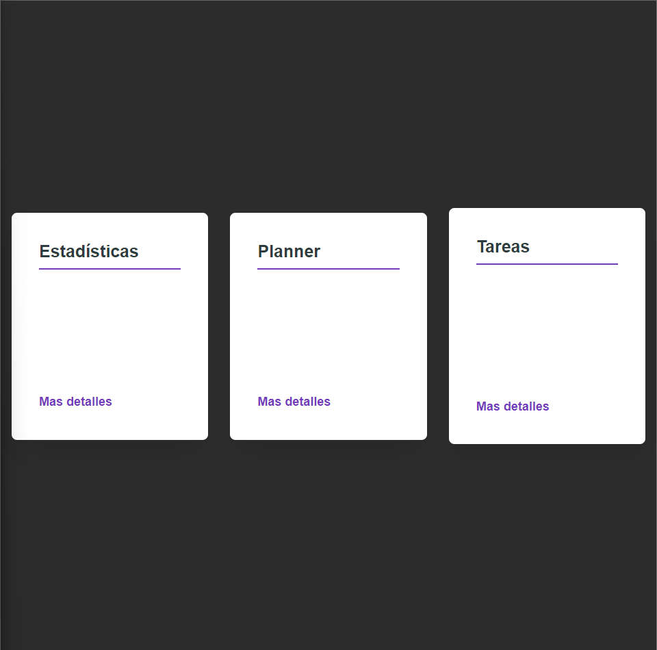
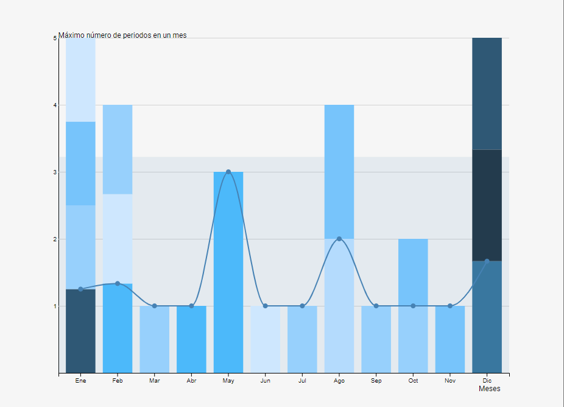
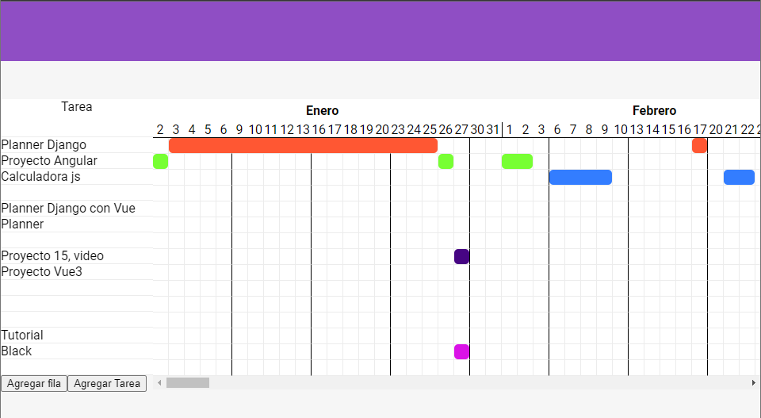
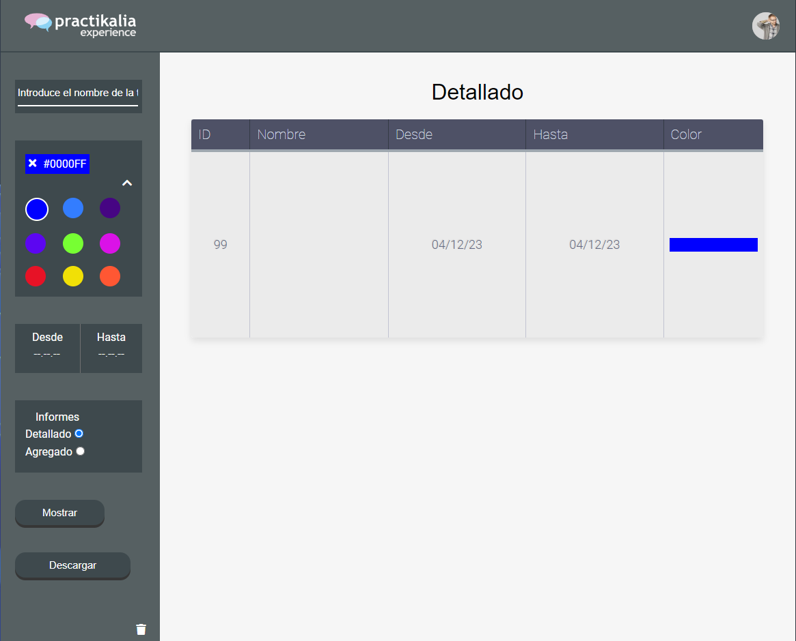

# Planner_Django_Vue

## Home

## Estadísticas

En la zona de estadísitcas hay una gráfica la cuál muestra el númeroi de periodos por mes de cada més. La gráfica de puntos muestra el el número de periodos de ese més, es decir, si en enero hay 4 tareas diferentes que tienen 4 periodos distintos en ese més ( Es decir, cada uno es distinto), pondrá un punto en el 1. Y por ultimo, la grafica de zona muestra la media de todos los periodos por tareas.

## Planner

Aquí es donde puedes gestionar tus tareas, moverlas,cambiar el color, estirararlas o borrarlas

## Informe

Aquí puedes ver las tareas filtradas, es decir, puedes buscar por el nombre y el color, por el color y la fecha, por solo la fecha etc etc. Además existen 2 tipos de informes, el agregado ( el cual saca medias de duracion de los periodos, media de periodos etc) y el Detallado, donde muestra la id, nombre, fecha y color de los periodos. Además de que se peden descargar los indormes y borrar los filtros.